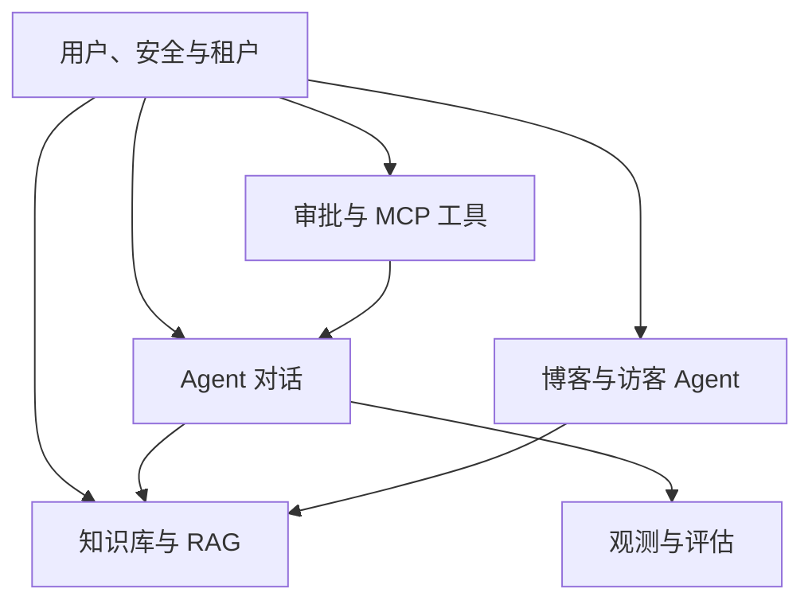
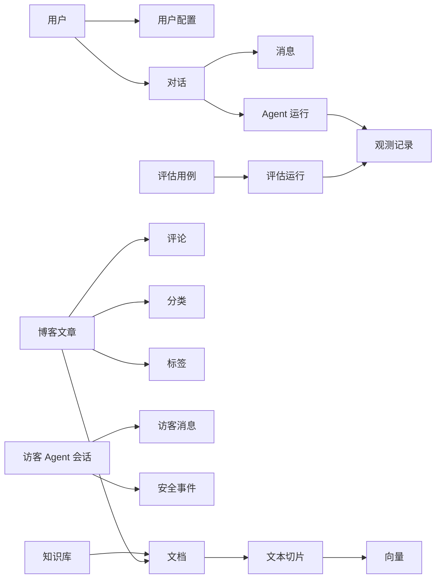
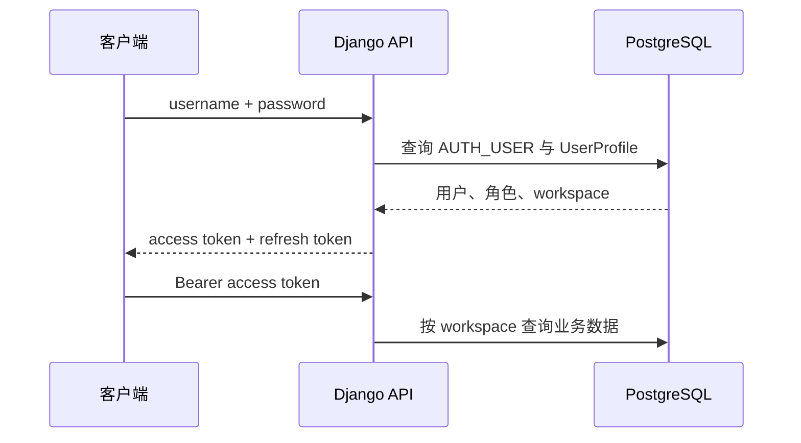
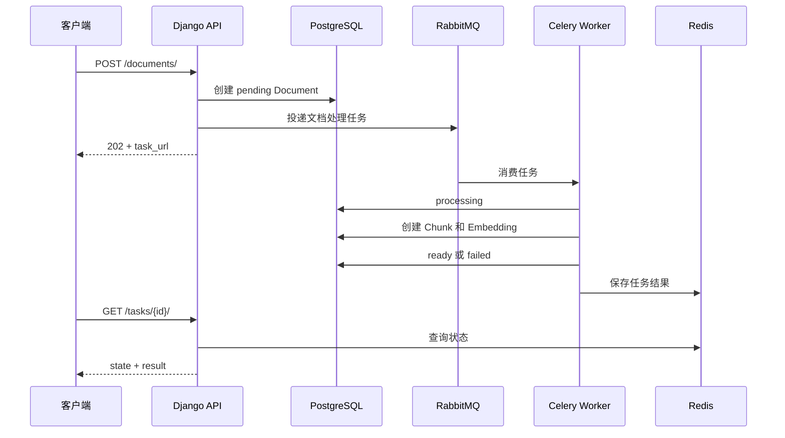
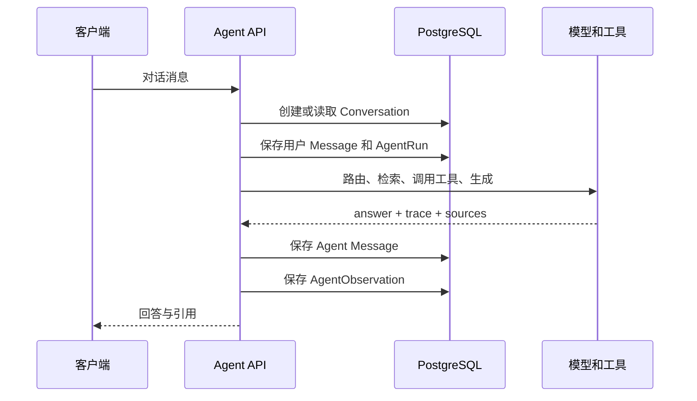

# 当前系统数据库设计说明

## 1. 文档目的

本文说明 Knowledge Agent Blog 系统当前数据库是如何从业务需求推导出来的，包括：

1. 需求分析；
2. 领域与数据边界划分；
3. 概念模型设计；
4. 逻辑表结构设计；
5. 主外键、删除策略和唯一约束；
6. 典型业务数据流；
7. Redis、RabbitMQ 与 PostgreSQL 的职责边界；
8. 当前设计的优点、问题和后续演进方向。

当前模型代码按领域拆分在 `backend/apps/agent_api/models/`，完整 ER 图见
[database-er-diagram.md](database-er-diagram.md)。

---

## 2. 需求分析

### 2.1 系统定位

当前系统同时承担两类业务：

- 面向内部用户的知识库、Agent 对话、工具调用、审批和评估平台；
- 面向访客的个人博客、文章检索和博客问答 Agent。

系统不是单纯的 CMS，也不是只有聊天记录的 AI 应用。数据库必须同时支持结构化内容、
非结构化文本、Agent 运行轨迹、向量数据、权限隔离和人工审批。

### 2.2 用户与安全需求

系统需要支持：

- Django 用户名和密码认证；
- JWT Access Token 与 Refresh Token；
- `admin`、`operator`、`visitor` 三种角色；
- 按 `workspace_key` 隔离不同工作空间的数据；
- 记录登录、越权、敏感输入、输出脱敏和工具拦截事件；
- 对删除、发布、执行工具等敏感操作进行人工审批。

因此需要用户扩展资料、安全审计和审批记录三类数据。

### 2.3 Agent 对话需求

内部 Agent 需要：

- 创建并保存多轮会话；
- 保存用户消息和 Agent 回复；
- 保存工具调用、引用来源、执行轨迹和 Token 消耗；
- 保存每次 Agent 运行的路由结果；
- 按用户和 workspace 查询历史会话；
- 对 Agent 响应进行延迟、成功率和失败原因分析。

因此对话本身、消息、运行记录和观测记录需要分表保存，避免把整个会话作为一个不断增长的
JSON 文档。

### 2.4 知识库与 RAG 需求

知识库需要支持：

- 一个知识库包含多份文档；
- 文档可以来自 Markdown、TXT、PDF 或直接文本；
- 文档处理具有 pending、processing、ready、failed 状态；
- 文档被切分成多个有顺序的文本块；
- 每个文本块拥有一条 Embedding；
- Agent 可以根据向量相似度和关键词相似度检索文本块；
- 删除文档时同时删除切片和 Embedding；
- 文档解析与向量生成交给 Celery 异步执行。

因此采用 `KnowledgeBase → Document → DocumentChunk → EmbeddingRecord`
四级结构。

### 2.5 博客需求

博客需要支持：

- 文章草稿、发布和归档；
- 分类与多标签；
- 文章评论；
- 浏览次数和发布时间；
- 已发布文章同步到知识库，供 Agent 检索；
- 访客在独立会话中向 Blog Agent 提问；
- 对访客问题进行频率限制和安全审计。

博客文章与知识文档不能合并成一张表：文章属于内容发布模型，文档属于 RAG 索引模型。
二者通过可空外键关联。

### 2.6 工具与治理需求

系统的 MCP 工具需要保存：

- 工具名称和展示名称；
- 工具类别；
- 权限范围；
- 是否启用；
- 是否需要人工审批；
- 工具配置和最后使用时间。

审批请求还需要保存操作类型、请求人、审批人、业务参数、审批结果和执行结果。

### 2.7 可观测性与评估需求

系统需要用固定问题集持续评估 Agent，因此需要：

- 保存评估问题和期望结果；
- 保存每次运行的实际答案和指标；
- 将评估运行关联到一次 Agent 观测记录；
- 支持计算正确性、忠实度、引用准确率、延迟和工具成功率。

---

## 3. 数据存储边界

系统不是把所有数据都放进 PostgreSQL。

| 存储组件 | 保存内容 | 选择原因 |
| --- | --- | --- |
| PostgreSQL | 用户、文章、对话、文档元数据、切片、审批、评估 | 需要事务、关联查询和持久化 |
| Redis | Celery 任务结果、任务状态、Django 缓存 | 低延迟，数据具有短期或可重建特征 |
| RabbitMQ | 待消费的 Celery 任务消息 | 支持可靠投递、确认、重试和队列路由 |
| 文件存储 | 上传的 PDF、Markdown、图片 | 大型二进制文件不适合直接放数据库 |

JWT 本身由客户端保存，服务端使用密钥验证签名。Access Token 和 Refresh Token
当前没有作为普通业务表保存。

---

## 4. 领域划分

数据库按六个领域理解：



### 4.1 用户与安全领域

- Django `AUTH_USER`
- `UserProfile`
- `SecurityAuditEvent`

### 4.2 Agent 对话领域

- `Conversation`
- `Message`
- `AgentRun`

### 4.3 知识库领域

- `KnowledgeBase`
- `Document`
- `DocumentChunk`
- `EmbeddingRecord`

### 4.4 博客领域

- `ArticleCategory`
- `ArticleTag`
- `BlogArticle`
- `BlogComment`
- `BlogAgentSession`
- `BlogAgentMessage`
- `BlogAgentSecurityEvent`

### 4.5 治理领域

- `ApprovalRequest`
- `MCPTool`

### 4.6 可观测性与评估领域

- `AgentObservation`
- `EvaluationCase`
- `EvaluationRun`

---

## 5. 概念模型设计

### 5.1 核心实体关系



### 5.2 主要基数

- 一个用户对应一个 `UserProfile`；
- 一个会话包含多条消息和多次 Agent 运行；
- 一次 Agent 运行可以产生多条观测记录；
- 一个知识库包含多份文档；
- 一份文档包含多个文本切片；
- 一个文本切片对应一条 Embedding；
- 一个分类包含多篇文章；
- 一篇文章拥有多个标签，一个标签也可以属于多篇文章；
- 一篇文章可以同步为一份知识文档；
- 一篇文章包含多条评论；
- 一个访客会话包含多条消息和安全事件；
- 一个评估用例可以被运行多次。

---

## 6. 逻辑表结构设计

### 6.1 用户资料表 `UserProfile`

Django 自带用户表负责用户名、密码哈希和账户状态，业务字段放在扩展表中。

| 字段 | 作用 |
| --- | --- |
| `user_id` | 一对一关联 Django 用户 |
| `role` | admin、operator 或 visitor |
| `workspace_key` | 用户所属工作空间 |
| `created_at/updated_at` | 审计时间 |

使用一对一扩展而不替换 Django User，可以复用 Django 认证、密码哈希和后台管理。

### 6.2 会话表 `Conversation`

| 字段 | 作用 |
| --- | --- |
| `title` | 对话标题 |
| `workspace_key` | 工作空间隔离 |
| `owner_username` | 会话所有者 |
| `created_at/updated_at` | 创建和最后更新时间 |

默认按 `updated_at` 倒序，便于展示最近会话。

### 6.3 消息表 `Message`

每条消息单独存储，通过 `conversation_id` 关联会话。

- `role` 区分 user 和 agent；
- `content` 保存正文；
- `tool_calls` 保存本次回复涉及的工具；
- `sources` 保存知识来源；
- `trace` 保存执行轨迹；
- `token_usage` 保存模型 Token 消耗。

将消息拆表可以实现分页加载、消息级检索和局部审计。

### 6.4 Agent 运行表 `AgentRun`

`AgentRun` 表示一次完整的 Agent 调用。它与最终消息不是同一概念：

- Message 面向用户展示；
- AgentRun 面向系统运行分析。

`route` 记录路由决策，其他 JSON 字段保留工具、来源和轨迹的动态结构。

### 6.5 观测表 `AgentObservation`

该表统一记录线上对话和离线评估的执行结果：

- 可以关联 `Conversation`；
- 可以关联 `AgentRun`；
- 记录输入、答案、路由和选中的 Agent；
- 记录耗时、工具成功率、失败原因；
- 可记录 LangSmith 项目和运行 ID。

两个外键都允许为空，因为离线评估可能没有真实会话，异常发生时也可能来不及创建完整
AgentRun。

### 6.6 知识库表 `KnowledgeBase`

知识库是文档的逻辑容器，通过 `workspace_key` 隔离。当前 `name` 是全局唯一，而不是
workspace 内唯一。

### 6.7 文档表 `Document`

文档表保存原始文件引用和处理状态：

```text
pending → processing → ready
                     ↘ failed
```

`source_file` 指向文件存储，`content_text` 支持直接保存纯文本，`chunk_count` 是便于展示的
冗余统计字段。

### 6.8 文本切片表 `DocumentChunk`

文本切片同时关联：

- 来源文档 `document_id`；
- 所属知识库 `knowledge_base_id`。

第二个外键有一定冗余，但能直接按知识库查询切片，减少跨文档关联。数据库通过
`(document_id, chunk_index)` 唯一约束防止同一文档出现重复序号。

### 6.9 Embedding 表 `EmbeddingRecord`

每个切片对应一条 Embedding，因此 `chunk_id` 使用一对一约束。

| 字段 | 作用 |
| --- | --- |
| `model` | 生成向量的模型 |
| `vector` | 当前以 JSON 数组保存向量 |
| `vector_dimensions` | 向量维度 |

当前实现由 Python 读取向量并计算相似度，数据量增大后应迁移到 pgvector。

### 6.10 博客文章表 `BlogArticle`

文章包含：

- 标题、Slug、摘要和正文；
- draft、published、archived 状态；
- 分类外键；
- 标签多对多关系；
- 浏览次数和发布时间；
- 指向知识文档的可空外键。

删除分类时使用 `SET_NULL`，避免误删文章。删除知识文档时也使用 `SET_NULL`，文章仍然保留，
但不再参与知识库检索。

### 6.11 分类、标签和中间表

`ArticleCategory` 是一对多关系，`ArticleTag` 是多对多关系。Django 会自动创建文章标签中间表，
并对文章和标签组合建立唯一约束。

### 6.12 评论表 `BlogComment`

评论从属于文章，文章删除时评论级联删除。`is_approved` 为后续评论审核预留。

### 6.13 访客 Blog Agent 表

`BlogAgentSession` 不依赖登录用户，通过随机 `session_key` 标识访客会话。

- `BlogAgentMessage` 保存提问和回答；
- `BlogAgentSecurityEvent` 保存被拦截的问题和原因；
- 安全事件的 Session 外键使用 `SET_NULL`，会话删除后仍保留安全证据；
- `ip_hash` 保存 IP 哈希，不直接保存原始 IP。

### 6.14 审批表 `ApprovalRequest`

审批表使用通用模型支持多种动作：

- 删除文档；
- 删除知识库；
- 删除或发布文章；
- 执行 SQL；
- 执行 MCP 工具；
- 外部部署；
- 发送邮件。

不同动作的业务参数放入 `payload` JSON。这样新增审批类型不必立即新增数据表，但失去了部分
外键约束。

### 6.15 MCP 工具表 `MCPTool`

工具定义与工具执行解耦。数据库保存工具元数据和安全策略，而真正执行逻辑位于应用层。

`name` 全局唯一，`permission_scope` 描述最小权限范围，`requires_approval` 决定是否进入
人工审批流程。

### 6.16 评估表

`EvaluationCase` 保存稳定的测试问题、期望路由、期望 Agent 和关键词。

`EvaluationRun` 保存一次测试结果：

- 关联用例；
- 可关联 AgentObservation；
- 保存实际回答；
- 使用 JSON 保存动态指标；
- 使用 `passed` 保存总体判断。

---

## 7. 外键和删除策略

| 父表 | 子表 | 删除策略 | 原因 |
| --- | --- | --- | --- |
| User | UserProfile | CASCADE | 用户不存在时配置无意义 |
| Conversation | Message | CASCADE | 消息不能脱离会话 |
| Conversation | AgentRun | CASCADE | 运行记录属于会话 |
| Conversation | AgentObservation | SET_NULL | 保留观测历史 |
| AgentRun | AgentObservation | SET_NULL | 保留独立观测证据 |
| KnowledgeBase | Document | CASCADE | 删除知识库同时删除文档 |
| Document | DocumentChunk | CASCADE | 删除文档同时删除索引 |
| DocumentChunk | EmbeddingRecord | CASCADE | 向量不能脱离切片 |
| ArticleCategory | BlogArticle | SET_NULL | 删除分类不能删除文章 |
| Document | BlogArticle | SET_NULL | 删除索引不能删除原文章 |
| BlogArticle | BlogComment | CASCADE | 评论从属于文章 |
| BlogAgentSession | BlogAgentMessage | CASCADE | 消息从属于访客会话 |
| BlogAgentSession | SecurityEvent | SET_NULL | 保留安全审计 |
| EvaluationCase | EvaluationRun | CASCADE | 运行结果从属于用例 |
| AgentObservation | EvaluationRun | SET_NULL | 删除观测时保留评估结论 |

---

## 8. 唯一约束与索引

### 8.1 已有唯一约束

- Django 用户名；
- KnowledgeBase.name；
- ArticleCategory.name 和 slug；
- ArticleTag.name 和 slug；
- BlogArticle.slug；
- BlogAgentSession.session_key；
- MCPTool.name；
- DocumentChunk 的 `(document_id, chunk_index)`；
- EmbeddingRecord.chunk_id；
- UserProfile.user_id。

### 8.2 已有普通索引

模型对以下高频隔离字段设置了索引：

- 多数业务表的 `workspace_key`；
- Conversation.owner_username；
- Django 自动为所有外键建立索引。

### 8.3 当前索引不足

随着数据增长，建议补充组合索引：

```text
Conversation(workspace_key, owner_username, updated_at)
Document(workspace_key, knowledge_base_id, status)
BlogArticle(workspace_key, status, published_at)
ApprovalRequest(workspace_key, status, created_at)
AgentObservation(workspace_key, status, created_at)
SecurityAuditEvent(workspace_key, event_type, created_at)
```

这些索引应通过 Django migration 创建，并在真实查询和 `EXPLAIN ANALYZE` 结果支持下调整。

---

## 9. 典型业务数据流

### 9.1 登录与 JWT



JWT 不替代数据库授权。Token 证明用户身份，数据库中的 UserProfile 决定角色和 workspace。

### 9.2 文档上传与异步索引



数据库保存业务最终状态，Redis 保存任务系统状态。即使 Redis 任务结果过期，Document.status
仍能反映文档是否处理成功。

### 9.3 Agent 对话



### 9.4 文章发布到知识库

文章先以草稿保存。发布请求创建 `ApprovalRequest`，审批通过后：

1. 将文章状态更新为 published；
2. 创建或更新对应 Document；
3. 切分文章内容；
4. 创建 DocumentChunk 和 EmbeddingRecord；
5. 将 Document ID 写入 BlogArticle.knowledge_document_id。

### 9.5 敏感操作审批

审批对象不直接删除或发布资源，而是先创建 `ApprovalRequest`。管理员审批通过后，应用层读取
`action` 和 `payload` 执行目标操作，再记录 `result` 和 `executed_at`。

---

## 10. 事务与一致性设计

### 10.1 数据库级一致性

系统主要依靠：

- 外键；
- CASCADE 或 SET_NULL；
- 唯一约束；
- Django `transaction.atomic`；
- 文档状态机；
- Celery 任务幂等设计。

### 10.2 文档任务幂等性

文档重新处理时应先删除旧切片和 Embedding，再创建新索引。这样同一任务被 RabbitMQ
重新投递时，不会不断追加重复切片。

### 10.3 跨组件一致性

PostgreSQL 写入和 RabbitMQ 投递不是同一个事务。更严格的生产设计应使用：

- `transaction.on_commit()`：数据库提交成功后再投递任务；
- Outbox Pattern：先在数据库写待发布事件，再由独立进程可靠投递到 RabbitMQ。

当前规模可以先使用 `on_commit`，需要强一致消息时再实现 Outbox。

---

## 11. 当前设计的优点

- 关系模型与业务域基本对应；
- 对话消息、运行和观测分离，便于分页与分析；
- 知识库采用标准的文档、切片、向量分层；
- 博客文章与 RAG 文档解耦；
- 删除策略同时考虑业务数据和审计数据；
- 动态的 trace、metrics、payload 使用 JSON，迭代成本较低；
- 通过 workspace_key 为多租户隔离预留了基础；
- Celery、Redis、RabbitMQ 与主数据库职责分离。

---

## 12. 当前问题与风险

### 12.1 workspace 只是字符串

目前没有 Workspace 表，也没有外键约束。不同表可能写入拼写不一致的 workspace_key。

建议新增：

```text
Workspace(id, key, name, created_at)
WorkspaceMember(workspace_id, user_id, role)
```

然后让业务表通过 `workspace_id` 建立外键。

### 12.2 owner_username 不是用户外键

用户名可以被修改，字符串关系无法保证引用完整性。建议 Conversation 增加可空
`owner_id` 外键，并保留 `owner_username_snapshot` 用于历史展示。

### 12.3 审批资源没有外键

JSON payload 灵活，但无法防止目标资源提前被删除。可以保留通用审批表，同时增加：

- `target_type`；
- `target_id`；
- 或使用 Django ContentType 的 GenericForeignKey；
- 对关键资源建立专用审批关联表。

### 12.4 向量使用 JSON

JSON 向量不能有效利用 PostgreSQL 的向量索引。数据量增大后应使用 pgvector：

```text
vector vector(1536)
HNSW / IVFFlat index
```

迁移时还需要按照模型区分维度，避免不同 Embedding 模型的数据混用。

### 12.5 部分唯一约束不符合多租户

KnowledgeBase.name 和 MCPTool.name 当前全局唯一。多 workspace 场景更合理的是：

```text
UniqueConstraint(fields=["workspace_key", "name"])
```

### 12.6 JSON 字段难以约束

tool_calls、metrics、payload、trace 等字段适合快速迭代，但字段结构由应用代码保证。
建议为 JSON 数据建立版本字段和 Serializer 校验，稳定后再拆成结构化表。

### 12.7 浏览计数并发更新

当前 `view_count += 1` 在高并发下可能丢失更新。应使用 Django `F("view_count") + 1`
执行数据库原子自增。

### 12.8 Refresh Token 撤销

当前 JWT Refresh Token 没有持久化黑名单。生产环境建议启用 SimpleJWT blacklist，
支持退出登录、密码修改和账户封禁后撤销令牌。

---

## 13. 推荐演进顺序

### 第一阶段：补强当前结构

1. 为常用查询增加组合索引；
2. 使用 `transaction.on_commit()` 投递 Celery 任务；
3. 使用 F 表达式更新文章浏览次数；
4. 给 JSON 字段增加输入 Schema 校验；
5. 增加数据库备份、恢复和迁移验证流程。

### 第二阶段：完善租户和认证

1. 新增 Workspace 和 WorkspaceMember；
2. 将 owner_username 改为用户外键；
3. 将全局唯一约束改为 workspace 内唯一；
4. 启用 Refresh Token 黑名单；
5. 统一所有查询的 workspace 过滤器。

### 第三阶段：提升 RAG 性能

1. 将 JSON 向量迁移为 pgvector；
2. 建立 HNSW 或 IVFFlat 索引；
3. 增加 embedding_model、embedding_version；
4. 支持批量重建和双版本索引切换；
5. 为大文档实现分批写入。

### 第四阶段：强化审计与事件一致性

1. 审批目标结构化；
2. 引入 Outbox Pattern；
3. 将关键工具调用记录为独立执行表；
4. 增加不可修改的审计事件保留策略；
5. 设计冷热数据归档。

---

## 14. 总结

当前数据库设计以 PostgreSQL 关系模型为核心，将系统拆分为用户安全、Agent 对话、知识库、
博客、治理和评估六个领域。稳定关联使用外键和唯一约束，变化频繁的 Agent 轨迹、工具参数和
评估指标使用 JSON；耗时任务由 RabbitMQ 和 Celery 调度，Redis 保存短期任务结果。

该设计适合当前功能规模并保留较高迭代速度。下一步最重要的数据库改进是正式建立 Workspace
实体、把用户名字符串关系改为外键、将 Embedding 迁移到 pgvector，并补充高频查询的组合索引。
