# 数据库结构图

下图根据 `backend/apps/agent_api/models/` 的当前模型生成。`workspace_key`
是多个业务表共同使用的逻辑租户字段，但目前不是外键，因此图中不画关系线。

```mermaid
erDiagram
    AUTH_USER {
        bigint id PK
        varchar username UK
        varchar password
        boolean is_active
        boolean is_staff
        boolean is_superuser
    }

    USER_PROFILE {
        bigint id PK
        bigint user_id FK,UK
        varchar role
        varchar workspace_key
        datetime created_at
        datetime updated_at
    }

    SECURITY_AUDIT_EVENT {
        bigint id PK
        varchar event_type
        varchar actor
        varchar role
        varchar workspace_key
        varchar path
        text detail
        json metadata
        datetime created_at
    }

    CONVERSATION {
        bigint id PK
        varchar title
        varchar workspace_key
        varchar owner_username
        datetime created_at
        datetime updated_at
    }

    MESSAGE {
        bigint id PK
        bigint conversation_id FK
        varchar role
        text content
        json tool_calls
        json sources
        json trace
        json token_usage
        datetime created_at
    }

    AGENT_RUN {
        bigint id PK
        bigint conversation_id FK
        varchar workspace_key
        text input_message
        varchar route
        json tool_calls
        json sources
        json trace
        json token_usage
        datetime created_at
    }

    AGENT_OBSERVATION {
        bigint id PK
        bigint conversation_id FK
        bigint agent_run_id FK
        varchar workspace_key
        text input_message
        text answer
        varchar route
        varchar selected_agent
        int latency_ms
        float tool_success_rate
        varchar status
        text failure_reason
        datetime created_at
    }

    EVALUATION_CASE {
        bigint id PK
        varchar workspace_key
        text question
        text expected_answer
        varchar category
        varchar expected_route
        varchar expected_agent
        json reference_keywords
        boolean is_active
    }

    EVALUATION_RUN {
        bigint id PK
        bigint case_id FK
        bigint observation_id FK
        varchar workspace_key
        text answer
        json metrics
        boolean passed
        datetime created_at
    }

    KNOWLEDGE_BASE {
        bigint id PK
        varchar name UK
        varchar workspace_key
        text description
        datetime created_at
        datetime updated_at
    }

    DOCUMENT {
        bigint id PK
        bigint knowledge_base_id FK
        varchar workspace_key
        varchar title
        varchar source_file
        text content_text
        varchar content_type
        varchar status
        text error_message
        int chunk_count
    }

    DOCUMENT_CHUNK {
        bigint id PK
        bigint document_id FK
        bigint knowledge_base_id FK
        int chunk_index
        text content
        int token_estimate
        json metadata
    }

    EMBEDDING_RECORD {
        bigint id PK
        bigint chunk_id FK,UK
        varchar model
        json vector
        int vector_dimensions
        datetime created_at
    }

    ARTICLE_CATEGORY {
        bigint id PK
        varchar name UK
        varchar slug UK
        text description
    }

    ARTICLE_TAG {
        bigint id PK
        varchar name UK
        varchar slug UK
    }

    BLOG_ARTICLE {
        bigint id PK
        bigint category_id FK
        bigint knowledge_document_id FK
        varchar workspace_key
        varchar title
        varchar slug UK
        text summary
        text content
        varchar status
        int view_count
        datetime published_at
    }

    BLOG_ARTICLE_TAGS {
        bigint id PK
        bigint blogarticle_id FK
        bigint articletag_id FK
    }

    BLOG_COMMENT {
        bigint id PK
        bigint article_id FK
        varchar author_name
        text content
        boolean is_approved
        datetime created_at
    }

    BLOG_AGENT_SESSION {
        bigint id PK
        varchar session_key UK
        varchar visitor_label
        varchar ip_hash
        text user_agent
        boolean is_blocked
    }

    BLOG_AGENT_MESSAGE {
        bigint id PK
        bigint session_id FK
        varchar role
        text content
        json sources
        json trace
        json token_usage
    }

    BLOG_AGENT_SECURITY_EVENT {
        bigint id PK
        bigint session_id FK
        text question
        varchar reason
        varchar ip_hash
        datetime created_at
    }

    APPROVAL_REQUEST {
        bigint id PK
        varchar action
        varchar workspace_key
        varchar title
        text description
        json payload
        varchar status
        varchar requester
        varchar reviewer
        text result
        datetime reviewed_at
        datetime executed_at
    }

    MCP_TOOL {
        bigint id PK
        varchar name UK
        varchar workspace_key
        varchar display_name
        varchar category
        varchar permission_scope
        boolean is_enabled
        boolean requires_approval
        json config
        datetime last_used_at
    }

    AUTH_USER ||--|| USER_PROFILE : has

    CONVERSATION ||--o{ MESSAGE : contains
    CONVERSATION ||--o{ AGENT_RUN : executes
    CONVERSATION o|--o{ AGENT_OBSERVATION : produces
    AGENT_RUN o|--o{ AGENT_OBSERVATION : records
    EVALUATION_CASE ||--o{ EVALUATION_RUN : has
    AGENT_OBSERVATION o|--o{ EVALUATION_RUN : evaluates

    KNOWLEDGE_BASE ||--o{ DOCUMENT : contains
    KNOWLEDGE_BASE ||--o{ DOCUMENT_CHUNK : groups
    DOCUMENT ||--o{ DOCUMENT_CHUNK : splits_into
    DOCUMENT_CHUNK ||--|| EMBEDDING_RECORD : embeds_as

    ARTICLE_CATEGORY o|--o{ BLOG_ARTICLE : categorizes
    DOCUMENT o|--o{ BLOG_ARTICLE : indexes
    BLOG_ARTICLE ||--o{ BLOG_COMMENT : receives
    BLOG_ARTICLE ||--o{ BLOG_ARTICLE_TAGS : maps
    ARTICLE_TAG ||--o{ BLOG_ARTICLE_TAGS : maps

    BLOG_AGENT_SESSION ||--o{ BLOG_AGENT_MESSAGE : contains
    BLOG_AGENT_SESSION o|--o{ BLOG_AGENT_SECURITY_EVENT : triggers
```

## 需要注意的逻辑关系

- `Conversation.owner_username`、`SecurityAuditEvent.actor` 当前是字符串，不是
  `AUTH_USER` 外键。
- `ApprovalRequest.payload` 通过 JSON 保存文档、文章或工具 ID，所以审批表与这些资源
  存在业务关系，但数据库没有外键约束。
- `MCPTool` 与审批请求也是通过 `payload.tool_id` 关联。
- Celery 任务状态存储在 Redis，不属于 PostgreSQL ER 图；RabbitMQ 只保存待消费消息。
- `EmbeddingRecord.vector` 当前是 JSON 字段；虽然 Docker 使用 pgvector 镜像，但模型尚未使用
  PostgreSQL `vector` 列。
