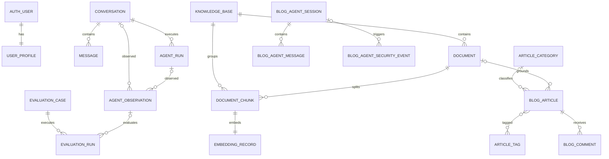

# 数据模型独立分层与实例表

## 1. 为什么把 Models 拆成目录

项目包含对话、RAG、博客、权限治理和评测等多个领域。如果所有模型都放在一个
`models.py` 中，文件会持续膨胀，模型关系和职责也难以识别。因此模型层采用：

```text
backend/apps/agent_api/models/
├── __init__.py       # 统一导出
├── constants.py      # 共享常量
├── agent.py          # 对话和运行
├── auth.py           # 身份和审计
├── knowledge.py      # 知识库
├── blog.py           # 博客
├── governance.py     # 审批和工具
└── evaluation.py     # 观测和评测
```

这些文件仍在 `agent_api` App 内，数据库表仍使用 `agent_api_*` app label，不会因为
Python 文件拆分而改变 migration 或外键关系。`models/__init__.py` 提供统一导入入口。

## 2. 整体关系图



`BlogArticle` 与 `ArticleTag` 的多对多关系由 Django 自动创建中间表
`agent_api_blogarticle_tags`。

## 3. 每个 Model 为什么这样设计

### 3.1 对话与执行模型

| Model | 关键设计 | 设计原因 |
|---|---|---|
| `Conversation` | `workspace_key`、`owner_username`、创建/更新时间 | 会话是消息聚合根；工作空间和所有者共同隔离私有历史，更新时间用于会话列表排序 |
| `Message` | 外键指向会话；`role` 使用枚举；执行信息使用 JSON | 消息必须从属于会话并级联删除；角色集合固定；工具、来源、Trace 和 Token 结构可能随 Agent 演进 |
| `AgentRun` | 单独保存输入、路由、工具、来源和 Token | 一次 Agent 执行不等同于一条展示消息，独立记录便于调试、统计和失败追踪 |

实例数据：

| 表 | id | 关键字段示例 |
|---|---:|---|
| `agent_api_conversation` | 12 | `title="卫晓斌资料查询"`, `workspace_key="default"`, `owner_username="admin"` |
| `agent_api_message` | 35 | `conversation_id=12`, `role="user"`, `content="他是哪个学校的？"` |
| `agent_api_agentrun` | 18 | `conversation_id=12`, `route="retrieve"`, `tool_calls=[{"name":"knowledge_search"}]` |

### 3.2 用户与安全模型

| Model | 关键设计 | 设计原因 |
|---|---|---|
| `UserProfile` | 与 Django User 一对一；保存业务角色和工作空间 | 登录凭证继续交给 Django，项目只扩展 Agent 平台需要的 RBAC 和租户信息 |
| `SecurityAuditEvent` | 不强制外键用户；保存 actor、路径、事件类型和 metadata | 即使匿名访问或用户被删除，安全事件仍需保留；JSON metadata 适配不同审计事件 |

实例数据：

| 表 | id | 关键字段示例 |
|---|---:|---|
| `agent_api_userprofile` | 3 | `user_id=1`, `role="admin"`, `workspace_key="default"` |
| `agent_api_securityauditevent` | 21 | `event_type="access_denied"`, `actor="visitor01"`, `path="/api/agent/approvals/"` |

### 3.3 知识库模型

| Model | 关键设计 | 设计原因 |
|---|---|---|
| `KnowledgeBase` | 名称唯一；带工作空间 | 作为文档集合和权限边界，避免文档直接散落 |
| `Document` | 文件、提取文本、类型、状态、错误和分块数 | 上传与异步解析存在生命周期，状态字段支持 Celery 任务展示和失败重试 |
| `DocumentChunk` | 同时关联文档和知识库；文档内 chunk 序号唯一 | 检索返回最小上下文片段；冗余知识库外键减少跨文档检索的关联成本 |
| `EmbeddingRecord` | 与 Chunk 一对一；记录模型、维度和向量 | 一个分块在当前方案中只保留一份有效向量，同时记录模型便于重新嵌入和版本迁移 |

实例数据：

| 表 | id | 关键字段示例 |
|---|---:|---|
| `agent_api_knowledgebase` | 2 | `name="人物资料库"`, `workspace_key="default"` |
| `agent_api_document` | 8 | `knowledge_base_id=2`, `title="卫晓斌简历.pdf"`, `status="ready"`, `chunk_count=6` |
| `agent_api_documentchunk` | 41 | `document_id=8`, `chunk_index=0`, `content="卫晓斌毕业于……"` |
| `agent_api_embeddingrecord` | 41 | `chunk_id=41`, `model="text-embedding-3-small"`, `vector_dimensions=1536` |

### 3.4 博客模型

| Model | 关键设计 | 设计原因 |
|---|---|---|
| `ArticleCategory` | 唯一名称和唯一 slug | 分类是一篇文章的主要归属，slug 支持稳定 URL 和过滤 |
| `ArticleTag` | 独立实体，与文章多对多 | 一篇文章可有多个主题，同一标签也能复用于多篇文章 |
| `BlogArticle` | 分类可空、标签多对多、发布状态、知识文档可空 | 草稿阶段可以没有分类；文章发布后可同步为 RAG 文档；`SET_NULL` 避免删除分类或知识文档时误删文章 |
| `BlogComment` | 文章外键、审核状态 | 评论依附文章，文章删除时应级联清理；审核字段为内容治理留入口 |
| `BlogAgentSession` | 随机 session key、IP 哈希、UA、封禁状态 | 公开访客未必登录，需要匿名会话连续性；只存 IP 哈希降低隐私风险 |
| `BlogAgentMessage` | 会话外键、角色、来源、Trace、Token | 将公开博客 Agent 与登录后的私有 Conversation 分离，避免权限和数据范围混淆 |
| `BlogAgentSecurityEvent` | Session 可空且 `SET_NULL` | 安全事件要长期保留，即使匿名会话被清理也不能丢失审计记录 |

实例数据：

| 表 | id | 关键字段示例 |
|---|---:|---|
| `agent_api_articlecategory` | 1 | `name="项目复盘"`, `slug="项目复盘"` |
| `agent_api_articletag` | 4 | `name="LangGraph"`, `slug="langgraph"` |
| `agent_api_blogarticle` | 9 | `title="Agentic RAG 实践"`, `status="published"`, `knowledge_document_id=11` |
| `agent_api_blogarticle_tags` | — | `blogarticle_id=9`, `articletag_id=4` |
| `agent_api_blogcomment` | 16 | `article_id=9`, `author_name="访客"`, `is_approved=true` |
| `agent_api_blogagentsession` | 5 | `session_key="8bc1…e29a"`, `ip_hash="sha256:…"`, `is_blocked=false` |
| `agent_api_blogagentmessage` | 22 | `session_id=5`, `role="agent"`, `content="该项目使用 LangGraph……"` |
| `agent_api_blogagentsecurityevent` | 2 | `session_id=5`, `reason="private information request"` |

### 3.5 治理模型

| Model | 关键设计 | 设计原因 |
|---|---|---|
| `ApprovalRequest` | 动作和状态枚举；请求、审核、执行分别记录时间和人员 | 删除、SQL、MCP、部署等高风险操作需要 Human-in-the-loop，并形成完整审计链 |
| `MCPTool` | 工具元数据、权限范围、开关、审批要求和配置 | 工具能力需要数据驱动管理，不能把启停和权限全部硬编码在 Agent 中 |

实例数据：

| 表 | id | 关键字段示例 |
|---|---:|---|
| `agent_api_approvalrequest` | 14 | `action="execute_mcp_tool"`, `status="pending"`, `requester="operator"` |
| `agent_api_mcptool` | 3 | `name="web_search"`, `category="web"`, `is_enabled=true`, `requires_approval=false` |

### 3.6 观测与评测模型

| Model | 关键设计 | 设计原因 |
|---|---|---|
| `AgentObservation` | Conversation 和 AgentRun 都可空；记录延迟、成功率、失败原因和 LangSmith ID | 既能观测真实对话，也能记录没有成功创建 Run 的异常；本地数据可与外部链路追踪关联 |
| `EvaluationCase` | 问题、期望答案/路由/Agent、关键词和启用状态 | 将评测输入与执行结果分离，使同一测试用例能够重复运行和做版本对比 |
| `EvaluationRun` | 外键指向 Case，可选关联 Observation，保存 metrics 和 passed | 每次评测都形成不可变结果，便于计算通过率和回归趋势 |

实例数据：

| 表 | id | 关键字段示例 |
|---|---:|---|
| `agent_api_agentobservation` | 31 | `route="retrieve"`, `selected_agent="rag_agent"`, `latency_ms=842`, `status="success"` |
| `agent_api_evaluationcase` | 7 | `question="他是哪个学校的？"`, `expected_agent="rag_agent"`, `category="knowledge"` |
| `agent_api_evaluationrun` | 44 | `case_id=7`, `observation_id=31`, `metrics={"grounded":1.0}`, `passed=true` |

## 4. 关系删除策略

| 策略 | 使用位置 | 原因 |
|---|---|---|
| `CASCADE` | 会话→消息、文档→分块、文章→评论 | 子记录脱离父记录后没有独立业务意义 |
| `SET_NULL` | 文章→分类/知识文档、Observation→Run、SecurityEvent→Session | 主记录或审计记录仍有保留价值 |
| `OneToOne` | User→Profile、Chunk→Embedding | 一个主体在当前版本只允许一个扩展或有效向量 |
| `ManyToMany` | Article↔Tag | 两侧都可以独立存在并被重复关联 |

## 5. JSONField 与普通字段的边界

- 需要索引、筛选、约束或稳定关联的内容使用普通字段和外键，例如状态、工作空间、角色。
- 结构会随工具或模型变化、主要用于回放的内容使用 JSON，例如 `tool_calls`、`trace`、`token_usage`。
- 向量目前使用 JSON 保存，适合本地演示；数据规模扩大后应迁移到 PostgreSQL + pgvector，
  并为向量字段建立 ANN 索引。

## 6. 设计上的后续改进

1. `KnowledgeBase.name`、分类名和标签名目前是全局唯一；严格多租户场景应改为
   `(workspace_key, name)` 联合唯一。
2. `BlogArticle.slug` 目前全局唯一；多站点部署可改为 `(workspace_key, slug)`。
3. `DocumentChunk.knowledge_base` 是有意冗余字段，应通过 Service 保证与
   `document.knowledge_base` 一致。
4. 向量数据增长后迁移到 pgvector；原 `EmbeddingRecord` 仍可保留模型版本和生成时间。
