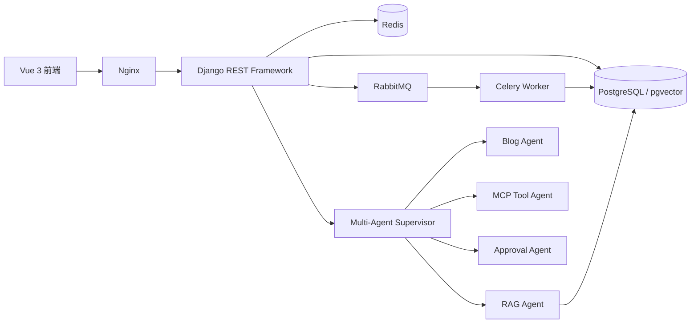

# 卫晓斌 Python 全栈开发面试作战手册

> 目标岗位：Python 全栈开发（Vue 3 + Django / Django REST Framework）  
> 简历依据：系统知识库中的《卫晓斌简历》及当前智能个人博客项目源码  
> 使用方式：先熟练掌握“自我介绍”和“项目主线”，再按题库逐层追问。任何数据都应以本人真实情况为准。

---

## 一、面试前必须修正的简历风险

### 1. SCI 论文数量不一致

简历中出现两种说法：

- 个人优势：第一作者发表 SCI 二区论文 1 篇。
- 教育经历：第一作者发表计算机视觉方向 SCI 二区论文 2 篇。

投递前必须统一。建议根据论文当前真实状态填写：

- 已正式发表：写“发表”。
- 已录用未见刊：写“录用”。
- 在投或返修：写“投稿/返修中”，不能写“发表”。

面试口径必须能回答：论文题目、研究问题、数据集、模型、你的贡献、指标、消融实验、期刊和当前状态。

### 2. 技能措辞偏弱

原简历多次使用“了解”“基础”，但投递目标是 Python 全栈开发。建议只在真正能够解释源码和独立排错的技术上提高措辞，例如：

- 熟悉 Python 常用语法、面向对象、异常处理、迭代器/生成器和常用标准库。
- 熟悉 Django、DRF 的模型、序列化器、APIView、认证权限、分页和 REST API 设计。
- 熟悉 Vue 3 Composition API、组件通信、路由、Pinia、TypeScript 和前后端联调。
- 掌握 Redis、Celery、RabbitMQ 的基本职责和异步任务链路。
- 了解 PostgreSQL、索引、事务、执行计划和 pgvector，并有项目实践。

不能只改文字。下面题库中的内容至少要能用自己的语言解释。

### 3. 项目数据应与当前实现一致

当前项目可以使用的真实数据：

- 后端自动化测试：60 项。
- Docker Compose 服务：7 个，包括 Vue/Nginx 前端网关、Django、PostgreSQL、Redis、RabbitMQ、Celery Worker、Celery Beat。
- 核心页面：博客、知识库、Agent 对话、审批、MCP 工具、可观测性、安全中心等。
- Agent：Supervisor 加 RAG、Blog、SQL Analysis、MCP Tool、Writing、Review、Admin Approval 等专用 Agent。

不要继续使用旧文档中的“37 项测试、8 个服务”等过期数字。

### 4. 项目时间与个人贡献

智能个人博客项目标注为 2026.05—2026.07。面试时应明确：

- 哪些功能完全由你独立实现。
- 哪些代码使用了 AI 辅助。
- AI 生成代码后你如何审查、测试、定位问题。
- 哪些方案是你经过取舍后决定的。

推荐回答：

> 项目由我独立规划和落地。我会使用 AI 辅助查资料、生成初稿和排查问题，但架构拆分、接口约束、数据库模型、权限边界和最终测试由我确认。我不会把 AI 生成结果直接当成正确答案，所有关键改动都要经过类型检查、Django tests 和真实 HTTP 冒烟测试。

---

## 二、自我介绍

## 2.1 30 秒版本

面试官只要求“简单介绍一下自己”时使用：

> 面试官您好，我叫卫晓斌，目前是重庆三峡科技大学计算机技术专业硕士研究生，本科就读于晋中学院计算机科学与技术专业。我的求职方向是 Python 全栈开发，主要技术栈是 Vue 3、TypeScript、Django 和 Django REST Framework。我独立开发过一个智能个人博客系统，完成了博客、知识库、JWT 登录、Agent 对话、异步任务和 Docker 部署，并结合 LangGraph 和 RAG 实现了基于个人内容的智能问答。我也有 Linux、Git、Redis、Celery 和 PostgreSQL 的实践经验。希望能够在实际业务中继续提升后端设计、前端工程化和系统稳定性能力。

## 2.2 90 秒推荐版本

> 面试官您好，我叫卫晓斌，目前是重庆三峡科技大学计算机技术专业硕士研究生，本科专业是计算机科学与技术，研究生专业排名前 5%，获得过特等奖学金和蓝桥杯研究生组国赛三等奖。科研方面，我参与过两项市级项目，并以第一作者开展过计算机视觉方向的 SCI 二区论文研究。这些经历锻炼了我快速学习、实验验证和定位问题的能力。
>
> 我的求职方向是 Python 全栈开发，前端主要使用 Vue 3、Vite、TypeScript，后端主要使用 Python、Django 和 Django REST Framework。最近我独立开发了一个智能个人博客和企业知识 Agent 平台。前端实现了 Markdown 写作、文章管理、知识库、对话、审批和可观测页面；后端采用 RESTful API，使用 JWT 认证、RBAC 和 workspace 隔离，并使用 Celery、RabbitMQ、Redis 处理文档切分、向量化等耗时任务。
>
> 项目的特色是使用 LangGraph 编排 Agentic RAG：系统会先分析问题，再进行知识库检索、相关性评分、查询改写、回答生成和来源引用；同时通过 Supervisor 将请求路由到 RAG Agent、Blog Agent 或 MCP Tool Agent。对于删除和高风险工具调用，我增加了人工审批和安全审计。项目目前有 59 项后端自动化测试，并通过 Docker Compose 组织完整服务。
>
> 我认为自己的优势是学习和落地能力比较强，能够从需求、数据库、接口、前端到部署完整推进项目。我也清楚自己还需要在大型团队协作和高并发生产经验上继续积累，希望能够在贵公司的真实业务中快速成长并创造价值。

## 2.3 3 分钟项目强化版本

> 面试官您好，我叫卫晓斌，目前是重庆三峡科技大学计算机技术专业硕士研究生，本科毕业于晋中学院计算机科学与技术专业。研究生阶段专业排名前 5%，获得过特等奖学金和蓝桥杯国赛三等奖。我还参与过两项市级科研项目，并开展过计算机视觉方向的 SCI 论文研究。科研训练让我形成了一个习惯：遇到问题先明确假设，再设计验证方法，最后根据结果迭代，而不是只凭感觉修改代码。
>
> 我应聘的是 Python 全栈开发。我的前端技术栈以 Vue 3、TypeScript、Vite 为主，后端以 Python、Django、Django REST Framework 为主，也使用过 PostgreSQL、Redis、Celery、RabbitMQ、Docker、Linux 和 Git。
>
> 最能代表我能力的是智能个人博客和知识 Agent 平台。这个项目最初是博客和知识库，后来我把它升级成了一个可控的多智能体系统。前端包含博客写作、文章详情、知识库上传与检索、Agent 对话、审批管理、MCP 工具和运行观测。后端按 models、serializers、views、services、tasks 分层，并通过 RESTful API 对外提供能力。
>
> 文档上传后不会在 HTTP 请求中同步完成全部处理，而是由 Django 创建任务，再通过 RabbitMQ 把任务发送给 Celery Worker。Worker 完成文本抽取、分块、embedding 和索引写入，Redis用于任务结果和缓存相关能力。这样上传接口可以快速返回 202 和 task_id，前端轮询任务状态，不会因为 PDF 解析或远程 embedding 导致请求长时间阻塞。
>
> Agent 部分使用 LangGraph 构建状态图。用户问题首先经过上下文查询改写，解决“他是哪个学校”这类追问丢失人物实体的问题；随后判断直接回答还是检索，检索后做相关性评分，如果分数过低最多改写一次查询，最后根据来源生成回答并附带引用。Supervisor 负责将不同请求路由到 RAG、博客、MCP、写作或审批 Agent。高风险删除和工具调用不会直接执行，而是创建审批单。
>
> 安全方面使用 JWT、角色权限、workspace 数据隔离、敏感输入检测和输出脱敏。工程质量方面目前有 59 项后端测试，前端经过 TypeScript 检查和 Vite 生产构建，并使用 Docker Compose 编排 8 个服务。
>
> 除此之外，我还负责过五子棋机器博弈项目，通过 Alpha-Beta 剪枝、候选点生成、评估函数和搜索深度控制，在低性能 Linux 环境中实现约 4 到 12 层搜索，项目获得国家一等奖。这个经历让我对算法复杂度、性能优化和受限环境部署也有实际体会。
>
> 我希望从 Python 全栈岗位开始，在真实业务里进一步提升接口设计、数据库优化、前端工程化和系统稳定性能力。

## 2.4 自我介绍禁区

- 不要背诵身份证式信息，不必主动说年龄、电话、期望薪资。
- 不要说“精通 Python、精通分布式”，除非能承受源码级追问。
- 不要把 LangChain、LangGraph 说成大模型；它们是应用开发与编排框架。
- 不要说 Redis 是消息队列而忽略项目中 RabbitMQ 才是 Celery broker。
- 不要说用了 PostgreSQL 就代表解决了高并发。
- 不要把本地 embedding 回退说成与商业 embedding 同等精度。
- 不要保证系统“绝对安全”“不会出错”，应说明风险、边界和改进方向。

---

## 三、项目讲解主线

## 3.1 一句话介绍

> 这是一个使用 Vue 3 和 Django REST Framework 开发的智能个人博客与知识管理平台，它把博客文章和上传文档转成可检索知识，并通过 LangGraph 多智能体工作流提供带来源引用、安全审批和运行观测的问答能力。

## 3.2 架构讲解

讲解顺序：

1. Vue 负责交互和状态展示。
2. Django/DRF 提供 REST API、认证、权限与数据持久化。
3. PostgreSQL 保存业务数据和向量；开发环境可回退 SQLite。
4. 文档处理通过 RabbitMQ + Celery 异步执行，Redis保存任务结果或缓存。
5. Supervisor 只负责路由，专用 Agent 负责具体任务。
6. 高风险动作通过 Human-in-the-loop 审批。
7. AgentRun、trace、latency、token usage 用于观测和评估。

## 3.3 STAR 项目回答

### Situation

传统个人博客只能展示静态内容，知识散落在文章、简历和项目文档中；普通 RAG 又缺少权限、审批、上下文和工程化部署。

### Task

独立实现一个前后端完整、可部署、可追踪、能够基于个人知识回答问题的系统，并保证敏感信息和高风险操作受到控制。

### Action

- Vue 3 + TypeScript 实现博客、编辑器、知识库、对话和管理工作台。
- Django + DRF 建立 RESTful 分层和数据库模型。
- 使用 JWT、RBAC、workspace 隔离实现访问控制。
- 使用 Celery + RabbitMQ + Redis 异步处理文档。
- 使用 LangGraph 实现检索、评分、改写、生成、引用状态图。
- 使用 Supervisor 路由多个专用 Agent。
- 建立审批、审计、可观测和自动化测试。

### Result

- 完成 8 个 Docker Compose 服务的一体化编排。
- 完成 59 项后端自动化测试。
- 支持博客与知识库联动、上下文追问、来源引用和高风险审批。
- 前端通过 TypeScript 检查和生产构建，后端通过 Django check、迁移检查和完整测试。

---

## 四、项目相关严格面试题

### 1. 为什么选择 Django，而不是 Flask 或 FastAPI？

参考回答：

> 项目不只是模型接口，还包含用户、博客、评论、知识库、审批、审计和后台数据，因此需要成熟 ORM、迁移、认证、Admin 和完整生态。Django 更适合这种数据和管理功能较多的系统。DRF 提供序列化、认证权限和 API 视图。FastAPI 在原生异步和轻量 API 上有优势，如果项目主要是高并发 I/O 网关，我会认真考虑 FastAPI；当前项目的核心耗时任务由 Celery 解耦，Django 的综合效率更高。

追问：Django 也支持 async view，为什么不用它处理文档向量化？

> async view 适合等待网络或文件 I/O，但 CPU 密集任务、长耗时任务和需要重试的任务仍会占用 Web 进程资源。Celery 能独立扩容、失败重试、记录状态，因此更适合文档解析和 embedding。

### 2. 为什么采用 RESTful API？

> 前后端职责清晰，资源用名词表示，HTTP 方法表达动作，例如 GET 查询、POST 创建、PATCH 部分更新、DELETE 删除。状态码也表达结果，例如创建返回 201，异步任务返回 202，参数错误返回 400，未认证返回 401，无权限返回 403。这样接口更容易测试、复用和维护。

### 3. 为什么 views、serializers、services、tasks 要分层？

> views 负责 HTTP 输入输出；serializers 负责校验和表示转换；services 负责可复用业务规则；tasks 负责异步执行；models 负责数据结构和少量领域约束。如果业务全写在 view 中，会导致接口难测试、逻辑重复，并且 Celery 任务无法复用同一套业务代码。

### 4. 文档上传的完整链路是什么？

> 前端通过 multipart/form-data 上传；DRF 校验并创建 Document，状态为 pending；后端调用 Celery task.delay，只发送 document_id；RabbitMQ 保存任务消息；Worker 读取数据库中的 Document，设置 processing，抽取文本、切片、生成 embedding、写入 DocumentChunk 和 EmbeddingRecord，最后设为 ready；接口立即返回 202、task_id 和 task_url；前端轮询状态。失败时记录 failed 和 error_message。

### 5. 为什么 Celery 消息只传 document_id？

> Django 模型实例和文件句柄不适合序列化，而且发送后可能过期。只传主键更小、更稳定，Worker 可以重新从数据库读取最新状态。

### 6. RabbitMQ、Redis、Celery 分别是什么？

> Celery 是分布式任务框架；RabbitMQ 在项目中作为 broker，负责可靠地接收和投递任务消息；Redis用于结果后端或缓存，保存任务执行结果和短期状态。Celery 不是消息中间件，Redis 和 RabbitMQ 也不是同一个角色。

### 7. 为什么同时使用 RabbitMQ 和 Redis？

> RabbitMQ 在消息确认、路由和可靠投递方面更专业；Redis 读写快，适合缓存和短期结果。职责分离更清晰。小型项目也可以只用 Redis 同时承担 broker 和 result backend，以减少运维成本，但可靠性和功能取舍要明确。

### 8. Celery 任务如何防止重复执行？

> 当前入库是重建式处理：先删除该文档旧切片，再生成新切片，因此结果基本幂等。但严格生产环境还需要任务锁、版本号或唯一约束，检查 document.status 和任务版本，避免两个 Worker 同时重建同一文档。对外部支付等动作则必须使用业务幂等键，不能只依赖 Celery。

### 9. Celery 重试策略是什么？

> 对 OSError 使用自动重试、指数退避、随机抖动和最大重试次数。网络 embedding 失败还会回退本地 embedding。应区分可重试异常和业务错误，参数错误不应无限重试。

### 10. LangGraph 状态图包含哪些节点？

> query_analyzer、retrieve、grade_documents、rewrite_query、generate、cite_sources。分析节点决定直接回答还是检索；检索节点调用知识库；评分节点判断相关性；低相关最多改写一次；生成节点根据有无来源采用不同提示词；最后保留引用。

### 11. 为什么用 LangGraph，不直接写 if/else？

> 少量步骤用 if/else 足够。选择 LangGraph 是因为流程存在条件分支、状态共享、查询重写循环和可观测 trace。状态图让节点边界和路由显式化，更方便测试和扩展。代价是依赖和学习成本更高，简单问答不应过度使用。

### 12. 如何解决 Agent 不结合上下文的问题？

> 后端从当前会话读取最近十条消息，以 role/content 结构传入 Agent。进入检索前先把当前追问改写成独立查询，例如上一轮问“卫晓斌的信息”，下一轮问“他是哪个学校”，改写后应包含“卫晓斌”和“学校”。这样既改善 Supervisor 路由，也改善知识库召回。

### 13. 为什么只取最近十条历史？

> 控制 prompt token、延迟和成本。缺点是长会话会丢失早期信息。生产改进可以采用滑动窗口加摘要记忆，把稳定实体和用户偏好写入结构化 memory。

### 14. RAG 和普通向量搜索有什么区别？

> 向量搜索只负责召回；RAG 是“检索 + 上下文组织 + 生成 + 引用/校验”的完整流程。Agentic RAG 又增加问题分析、文档评分、查询改写和失败兜底等动态决策。

### 15. 文档为什么要切片？如何选择 chunk size 和 overlap？

> 整篇文档通常超过模型上下文，而且一个向量难以表达多个主题。切片能提高局部语义召回。chunk 太小会丢上下文，太大会引入噪声；overlap 保留跨边界语义，但会增加存储和重复召回。应根据文档结构、模型 token 限制和评估集调参，而不是只使用固定经验值。

### 16. 项目如何计算相关性？

> 使用向量余弦相似度和关键词相关度组成混合分数，并对中文人名、拼音顺序、学校/单位等查询做扩展。混合检索可以弥补 embedding 对精确名称和缩写不稳定的问题。

### 17. 为什么要做文档多样性？

> 一个长 PDF 可能有很多相似切片，占满 Top-K，导致其他相关文档没有机会进入上下文。项目先为接近全局最高分的不同文档保留一个位置，再按分数补齐。精确查询只有一个强相关文档时，仍允许同一文档多个片段进入。

### 18. 本地 embedding 回退的意义和缺点是什么？

> 意义是没有外网或 API Key 时仍能开发和测试完整链路，而且结果确定。缺点是语义质量明显低于专业 embedding，不能把它当生产精度方案。生产应使用稳定模型，并保证文档向量和查询向量使用同一模型与维度。

### 19. 为什么使用 pgvector？

> 向量和业务数据可以放在同一 PostgreSQL 中，事务和备份更统一，适合中小规模知识库。数据规模很大或检索要求复杂时，可以考虑 Milvus、Qdrant、Elasticsearch 等专用方案。选择取决于规模、过滤需求、运维成本和延迟。

### 20. Supervisor 如何路由？

> 先执行敏感输入检查和治理路由，然后识别 MCP、博客、SQL、RAG、写作等意图。路由时结合最近对话，避免追问失去上下文。Supervisor 只做选择和 handoff，不把所有业务塞在一个类中。

### 21. MCP 是什么？项目里的实现是真正的远程 MCP Server 吗？

> MCP 是模型与外部工具/资源交互的标准协议。当前项目实现的是本地 MCP 风格适配层和数据库工具注册表，强调统一工具名称、参数、权限、审批和执行记录；如果没有完整实现协议握手、transport 和标准 server/client，就不应夸大为完整远程 MCP 服务。

### 22. 如何避免模型调用任意本地函数？

> 工具使用显式白名单分派，Supervisor 先读取数据库 MCPTool 注册项，检查存在、启用状态、权限范围和审批要求；runner 不使用任意反射或 eval。工具输入还要做路径、URL、SQL 等参数校验。

### 23. Human-in-the-loop 如何实现？

> 检测到文章删除或高风险 MCP 请求后，不立即执行，而是创建 ApprovalRequest，接口返回 202 和 approval_required。管理员审核后调用审批接口，批准才执行对应 action，并记录 reviewer、note、result 和状态。

### 24. 为什么审批不能只放在前端？

> 前端控制可以被绕过。真正的权限和审批必须在后端执行路径上检查，前端只负责展示和提交决定。

### 25. JWT 的登录链路是什么？

> 用户登录后后端签发 access 和 refresh token。前端保存令牌，请求时通过 Authorization: Bearer access 发送。access 过期后使用 refresh 获取新 access。后端从 token 识别 user，再读取 role 和 workspace。生产中还需要考虑 XSS、token 存储、刷新令牌轮换、注销黑名单和 HTTPS。

### 26. 401 和 403 有什么区别？

> 401 表示未认证或凭据无效；403 表示身份已确认但没有权限。不能为了方便全部返回 400。

### 27. workspace 隔离如何实现？

> 数据模型保存 workspace_key，查询会同时按 workspace 和 owner 过滤。不能只依赖前端传 workspace，也不能获取对象后再判断；应该在 queryset 阶段限制，防止 IDOR。

### 28. 如何防 Prompt Injection？

> 先对敏感输入和越权语句做规则过滤；网页内容被标记为不可信数据，提示词明确不能把其当系统指令；工具使用白名单和后端权限；输出做密钥模式脱敏。仅靠提示词不够，真正安全边界应由代码和权限系统保证。

### 29. Agent 如何观测？

> 保存 AgentRun、route、tool_calls、sources、trace、token_usage、latency 和失败原因。前端可以展示每轮走了哪个 Agent、调用哪个工具、引用什么来源。生产还可接 OpenTelemetry、Prometheus、日志关联 ID 和告警。

### 30. 如何评估 RAG？

> 建立固定评估集，覆盖可回答、不可回答、上下文追问、中文人名、越权攻击和工具调用。指标包括召回率、来源相关性、回答正确性、引用一致性、拒答准确率、延迟和 token 成本。不能只看“回答像不像”。

### 31. 项目最大的技术难点是什么？

推荐回答：

> 最大难点不是接通模型，而是让检索、上下文和安全形成可验证闭环。比如追问中的代词会导致检索实体丢失，所以我在进入 RAG 前增加上下文查询改写；单个长文档会占满 Top-K，所以增加文档多样性；高风险工具不能只靠模型判断，所以在 REST 执行路径上增加审批和白名单。

### 32. 当前项目还有哪些不足？

> 第一，应用层遍历向量适合当前数据量，大规模时应使用 pgvector 索引和数据库 Top-K；第二，会话记忆只取最近消息，可增加摘要记忆；第三，规则路由可升级为结构化分类模型但必须保留安全优先级；第四，前端和编辑器 bundle 偏大，可进一步按组件和依赖拆包；第五，需要真实压测、监控告警和备份恢复演练。

---

## 五、Python 严格面试题

### 1. list、tuple、set、dict 的区别？

- list：有序、可变、允许重复，按索引访问。
- tuple：有序、不可变，可作为 dict key 的前提是所有元素可哈希。
- set：无序语义、元素唯一，适合集合运算和去重。
- dict：键值映射，Python 3.7+ 保证插入顺序，键必须可哈希。

### 2. `is` 和 `==` 的区别？

`is` 比较对象身份，`==` 比较值。判断 `None` 应使用 `is None`。不能依赖小整数或字符串驻留现象。

### 3. 浅拷贝和深拷贝？

浅拷贝只复制外层容器，嵌套对象仍共享；深拷贝递归复制。不可变对象通常无需复制。应说明 `copy.copy`、`copy.deepcopy` 和实际内存影响。

### 4. 可变默认参数为什么危险？

默认参数在函数定义时创建一次，多个调用共享同一个对象。应使用 `None`，在函数内部创建新 list/dict。

### 5. `*args` 和 `**kwargs`？

`*args` 收集位置参数为 tuple，`**kwargs` 收集关键字参数为 dict；调用时也可用于解包。

### 6. 装饰器本质是什么？

接收函数并返回可调用对象的高阶函数。使用 `functools.wraps` 保留原函数元数据。Django 的登录校验、事务和缓存都可使用装饰器思想。

### 7. 迭代器和生成器区别？

迭代器实现 `__iter__` 和 `__next__`；生成器由包含 `yield` 的函数创建，是迭代器的一种。生成器惰性计算，适合大数据流，但只能向前消费。

### 8. `yield from` 有什么作用？

把迭代委托给子迭代器，并能转发 send/throw/close 和接收子生成器返回值，比手写循环更完整。

### 9. 上下文管理器是什么？

通过 `__enter__`/`__exit__` 或 `contextlib.contextmanager` 管理资源，确保异常时也关闭文件、锁或事务。

### 10. Python 异常处理的正确原则？

捕获尽可能具体的异常，不吞异常；在有能力恢复的层处理；保留上下文可用 `raise ... from exc`；`finally` 用于资源清理。

### 11. GIL 是什么？

CPython 中同一进程通常一次只有一个线程执行 Python 字节码。I/O 密集线程仍有价值，因为等待 I/O 时会释放 GIL；CPU 密集可用多进程、原生扩展或任务队列。GIL 不代表代码线程安全。

### 12. 线程、进程、协程如何选择？

- I/O 密集且库是同步的：线程。
- CPU 密集：多进程。
- 大量可异步 I/O：asyncio 协程。
- 跨机器、需重试和持久化的后台任务：Celery。

### 13. `async`/`await` 的原理？

协程遇到 await 把控制权交回事件循环，事件循环在 I/O 就绪后恢复。任何阻塞同步调用都会卡住整个事件循环，需使用异步库或线程池。

### 14. `__new__` 和 `__init__`？

`__new__` 创建并返回实例，`__init__` 初始化已创建实例。不可变类型定制或单例可能使用 `__new__`。

### 15. 类方法、静态方法、实例方法？

实例方法接收 self；类方法接收 cls，适合替代构造器；静态方法不自动接收对象，只是放在类命名空间中的相关函数。

### 16. MRO 和 `super()`？

Python 使用 C3 线性化确定多继承查找顺序。`super()` 表示按 MRO 找下一个实现，不一定只是“父类”。

### 17. `__slots__` 的作用？

限制实例属性并可能减少大量实例内存，但会影响动态属性、继承和部分工具兼容，不应无脑使用。

### 18. dict 为什么平均 O(1)？

基于哈希表，通过 key 的 hash 定位槽位；冲突需要探测，极端情况下会退化。扩容会产生阶段性成本。

### 19. 什么是哈希对象？

生命周期内 hash 值稳定且可比较。通常不可变对象可哈希，但 tuple 中包含 list 时不可哈希。

### 20. 垃圾回收机制？

CPython 以引用计数为主，循环垃圾收集器处理引用环。`del` 删除名字绑定，不保证对象立刻销毁。

### 21. 闭包和 late binding？

闭包捕获变量而不是创建时的值，循环中创建 lambda 常在调用时读取最终变量。可用默认参数绑定当时值。

### 22. 类型注解运行时会强制检查吗？

通常不会。它服务于 IDE、mypy、pyright 等静态工具。Pydantic/DRF serializer 才会在运行时做校验转换。

### 23. Python 中如何写单元测试？

使用 unittest 或 pytest，遵循 Arrange-Act-Assert；隔离外部 API、时间和随机性；测试行为而不是内部实现；数据库测试关注事务和边界。

### 24. monkey patch 的风险？

运行时替换对象，方便测试但隐藏依赖、难追踪且可能影响全局。优先依赖注入和 mock patch 的最小作用域。

### 25. 说出你在项目中的 Python 使用点

> dataclass 定义 Agent 响应；TypedDict 定义 LangGraph 状态；Path 处理项目路径；正则检测敏感输入；生成器思想用于分页/数据流；异常和 fallback 保证模型服务不可用时仍有可解释结果。

---

## 六、Django 与 DRF 严格面试题

### 1. Django 请求生命周期

Web Server 接收请求，经 WSGI/ASGI 进入 Django；依次经过 middleware、URL resolver、view；view 调用 serializer/service/ORM；生成 response 后反向经过 middleware 返回。

### 2. WSGI 和 ASGI 区别

WSGI 主要是同步请求接口；ASGI 支持异步、WebSocket 和长连接。使用 ASGI 不会自动把同步 ORM 和阻塞库变成异步。

### 3. ORM 如何避免 N+1？

外键/一对一使用 `select_related` 做 JOIN；多对多/反向关系使用 `prefetch_related` 分开查询后合并。使用 Django Debug Toolbar 或查询日志验证。

### 4. `get`、`filter`、`first` 区别

`get` 期望唯一，否则抛 DoesNotExist/MultipleObjectsReturned；`filter` 返回 QuerySet；`first` 返回首个对象或 None。

### 5. QuerySet 是否惰性？

是。迭代、list、len、bool、切片部分操作等会触发查询。重复求值可能重复查询，求值后 QuerySet 有结果缓存。

### 6. `save()` 和 `update()` 区别？

`save` 走模型方法和部分信号；QuerySet.update 直接执行 SQL，不调用每个实例的 save，适合批量更新。二者都要考虑并发和业务钩子。

### 7. `transaction.atomic` 做什么？

建立事务边界，异常时回滚。嵌套通常使用 savepoint。事务应尽量短，不在事务中做长时间网络请求。

### 8. 如何处理并发扣库存？

不能先读再随意写。可使用 `select_for_update` 悲观锁，或 `F()` 表达式加条件更新实现乐观方式，并检查受影响行数。

### 9. migration 的作用？

把模型变化保存为可版本化的数据库迁移。生产中先检查兼容性，避免直接删除大字段或执行长锁表操作，可采用扩展—迁移数据—收缩策略。

### 10. serializer 的职责？

输入反序列化、字段校验、对象创建/更新、输出表示。复杂业务不应全部塞入 serializer，可以调用 service。

### 11. `Serializer` 与 `ModelSerializer`？

ModelSerializer 根据模型自动生成字段和部分验证；Serializer 更显式，适合非模型输入、聚合接口或需要完全控制的结构。

### 12. `is_valid(raise_exception=True)` 的意义？

统一触发 DRF ValidationError 并返回标准 400，避免忘记处理 errors。

### 13. APIView、GenericAPIView、ViewSet 如何选？

特殊流程使用 APIView；常规 CRUD 使用 GenericAPIView/mixins；资源接口较统一时用 ViewSet + router。不能为了“高级”强行使用 ViewSet。

### 14. authentication 和 permission 区别？

authentication 回答“你是谁”，permission 回答“你能否做这件事”。对象级权限还要检查具体资源归属。

### 15. CSRF 和 JWT 的关系？

若 JWT 放 Authorization header，浏览器不会像 Cookie 那样自动附带，传统 CSRF 风险较低，但仍有 XSS 风险。若 token 放 Cookie，仍需 SameSite、CSRF 等防护。

### 16. Django 中间件适合做什么？

请求日志、关联 ID、统一安全头、跨域等横切逻辑。不适合承载具体业务。

### 17. 信号为什么要谨慎？

隐式触发、难追踪、可能造成递归或事务问题。核心业务流程优先显式 service 调用；信号适合低耦合辅助动作。

### 18. 如何实现文件上传安全？

限制大小和扩展名但不能只信扩展名；检测 MIME；生成服务端文件名；隔离存储目录；防路径穿越；必要时病毒扫描；禁止用户上传内容直接执行。

### 19. 如何分页？

列表接口使用 limit/offset 或 cursor。数据不断变化且规模大时 cursor 更稳定；项目会话消息使用 before/anchor，便于向上加载和定位搜索结果。

### 20. 如何设计错误响应？

使用正确 HTTP 状态码、稳定 detail/code、字段级 errors；服务端记录堆栈但不能把密钥和内部堆栈直接返回客户端。

### 21. Django 缓存可放什么？

高频、计算昂贵、允许短期不一致的数据。设置 TTL、命名空间和失效策略。用户权限和高度敏感数据不能随意缓存。

### 22. `ALLOWED_HOSTS`、CORS、CSRF_TRUSTED_ORIGINS` 区别？

ALLOWED_HOSTS 防伪造 Host；CORS 控制浏览器跨域读取；CSRF_TRUSTED_ORIGINS 指定可信跨站来源。三者不是同一机制。

### 23. Django 如何记录日志？

配置 logger、handler、formatter；按模块和级别输出；生产采用结构化日志和 request_id；禁止记录密码、完整 token。

### 24. 如何测试 DRF API？

使用 APIClient/APITestCase，覆盖成功、校验失败、未认证、无权限、资源不存在、跨用户访问、分页和幂等性；外部 LLM 和任务队列应 mock 或 eager。

### 25. 为什么测试环境让 Celery eager？

任务在当前进程同步执行，测试无需启动 RabbitMQ/Worker，断言确定且速度快。但还应有少量集成测试验证真实 broker 和 Worker。

---

## 七、Vue 3 与 TypeScript 严格面试题

### 1. Vue 2 和 Vue 3 主要区别？

Vue 3 使用 Proxy 响应式、Composition API、更好的 TypeScript 支持、Fragment、Teleport、Suspense，并改善 tree-shaking。

### 2. `ref` 和 `reactive`？

ref 可包装任意值，通过 `.value` 访问；模板会自动解包。reactive 返回对象 Proxy，解构会丢响应性，需 `toRefs`。团队应保持一致规则。

### 3. `computed` 和 `watch`？

computed 用于有缓存的派生值，应尽量无副作用；watch 用于响应变化执行异步请求、存储等副作用。

### 4. `watch` 和 `watchEffect`？

watch 显式指定依赖并能获得新旧值；watchEffect 自动收集同步执行阶段读取的依赖，方便但依赖不够显式。

### 5. 组件通信方式？

父传子 props，子传父 emits；跨层使用 provide/inject；全局共享状态使用 Pinia；不要用全局事件总线制造隐式依赖。

### 6. 为什么 props 不应直接修改？

数据流应保持单向，父组件是数据来源。可以 emit `update:modelValue` 实现 v-model。对象嵌套修改虽然技术上可能生效，但会增加耦合，应谨慎。

### 7. `v-if` 和 `v-show`？

v-if 创建/销毁节点，切换成本高、初始可不渲染；v-show 只切换 CSS display，适合频繁切换。

### 8. `v-for` 为什么需要 key？

key 帮助虚拟 DOM 稳定识别节点，正确复用和移动组件状态。不要在可重排列表中使用 index。

### 9. Vue 生命周期？

常用 onMounted 获取 DOM/启动请求，onBeforeUnmount 清理监听器和定时器。不能忘记清理全局 pointermove、WebSocket 等资源。

### 10. `nextTick` 的作用？

状态修改后 DOM 更新是批处理异步的；nextTick 等待当前更新刷新完成。项目发送消息后用它再滚动到底部。

### 11. 路由守卫如何实现登录控制？

全局 beforeEach 检查 auth store；未加载先 bootstrap；公共路由允许访问；未登录跳登录并保留 redirect；管理员路由检查角色。后端仍必须重复鉴权。

### 12. Pinia 适合存什么？

跨页面共享的认证会话、用户信息、全局配置。只属于单个页面的输入和弹窗状态放本地组件，避免 store 膨胀。

### 13. TypeScript 的 interface 和 type？

interface 适合对象结构和声明合并；type 可表达联合、交叉、条件等更复杂类型。项目内保持一致即可。

### 14. `unknown` 和 `any`？

any 关闭类型检查；unknown 使用前必须缩小类型，更安全。接口错误响应应先验证结构而不是直接 any。

### 15. 前端如何处理 JWT？

统一 API client 添加 Authorization；遇到 401 尝试 refresh；并发刷新需要锁，避免同时刷新多次；刷新失败清理会话并跳登录。

### 16. 如何防 XSS？

默认插值会转义；谨慎使用 v-html；Markdown HTML 要消毒；CSP；不把不可信字符串拼入 DOM；token 若存 localStorage 会受 XSS 影响。

### 17. 项目如何优化聊天体验？

乐观插入用户消息和 pending 回答；响应后原位更新对象；nextTick 后滚动；历史采用 before 分页；加载旧消息时根据前后 scrollHeight 差恢复位置。

### 18. Vite 为什么快？

开发环境利用原生 ESM，按需转换模块，并使用 esbuild 预构建依赖；生产仍使用 Rollup 打包。

### 19. 如何减小 bundle？

路由懒加载、重型编辑器动态加载、manualChunks、按需引入组件库、分析 bundle、移除未使用依赖。不能只提高 warning 阈值掩盖问题。

### 20. 前端错误处理怎么做？

API 层统一处理网络、401 和 JSON 解析；页面展示用户可理解信息；全局 errorHandler/监控捕获未知错误；不能静默 catch。

---

## 八、数据库、Redis、Celery 与 RabbitMQ

### 1. PostgreSQL 和 MySQL 如何选择？

两者都成熟。PostgreSQL 类型、复杂查询、扩展能力和 pgvector 适合当前项目；MySQL 在大量传统 Web 业务中生态广。不要只说 PostgreSQL“更高级”。

### 2. 什么是数据库索引？

额外数据结构，用空间和写入成本换查询速度。常见 B-tree 适合等值、范围和排序。索引不是越多越好。

### 3. 联合索引最左前缀？

索引 `(a,b,c)` 通常可支持从 a 开始的条件组合；跳过 a 往往不能充分利用。还要结合数据库优化器和实际执行计划。

### 4. 什么情况下索引失效或效果差？

低选择性字段、对列做函数、前导模糊匹配、隐式类型转换、返回数据占比过高等。应使用 EXPLAIN 验证。

### 5. ACID 是什么？

原子性、一致性、隔离性、持久性。业务一致性不只靠数据库，还需要正确约束和事务边界。

### 6. 隔离级别和问题？

读未提交、读已提交、可重复读、串行化；分别涉及脏读、不可重复读、幻读。PostgreSQL 默认 Read Committed。

### 7. 乐观锁与悲观锁？

悲观锁先锁行，例如 select for update；乐观锁用版本号或条件更新，冲突后重试。冲突频率决定选择。

### 8. Redis 常用数据结构？

String、Hash、List、Set、Sorted Set、Stream、Bitmap、HyperLogLog。必须能结合缓存、排行榜、去重、消息流说明。

### 9. 缓存穿透、击穿、雪崩？

- 穿透：查询不存在数据，可缓存空值或布隆过滤器。
- 击穿：热点 key 过期，大量请求回源，可互斥重建或逻辑过期。
- 雪崩：大量 key 同时过期，可随机 TTL、限流降级和高可用。

### 10. 如何保证缓存与数据库一致？

常见 Cache Aside：读先缓存，miss 查数据库并回填；写先更新数据库再删除缓存。强一致很难，需要根据业务容忍度设计。

### 11. Redis 持久化？

RDB 快照、AOF 日志，也可混合。RDB 恢复快但可能丢最近数据；AOF 更完整但文件和恢复成本更高。

### 12. RabbitMQ 消息确认？

Producer confirm 确认消息到 broker；consumer ack 确认处理完成。任务必须处理重复投递，不能把 ack 当业务幂等。

### 13. 什么是死信队列？

消息被拒绝、过期或队列超长后路由到死信交换机，便于隔离失败任务和人工处理。

### 14. RabbitMQ 如何避免消息丢失？

持久化 exchange/queue/message、publisher confirm、consumer 手动 ack、高可用队列，并配合业务幂等。任何单一配置都不是绝对保证。

### 15. Celery Worker 宕机会怎样？

取决于 ack 时机。任务未确认可重新投递，因此可能重复执行。必须让任务幂等，并设置合理 `acks_late`、超时和重试。

### 16. Celery Beat 是什么？

周期任务调度器，只负责按计划投递任务，真正执行仍由 Worker 完成。生产通常只运行一个 Beat 或使用支持锁的调度方案。

### 17. 任务超时如何设置？

soft time limit 给任务清理机会，hard time limit 强制终止。还要给外部 HTTP 请求设置连接和读取超时。

### 18. 异步任务如何向前端反馈？

创建任务返回 202 和 task_id/task_url；前端轮询，或通过 SSE/WebSocket 推送。轮询简单可靠，实时性和请求量之间要权衡。

---

## 九、网络、安全、Linux 与部署

### 1. HTTP 和 HTTPS 区别？

HTTPS 是 HTTP over TLS，提供加密、完整性和服务端身份验证。生产 JWT 和登录必须使用 HTTPS。

### 2. TCP 三次握手为什么不是两次？

双方都要确认自己的发送和接收能力，并避免历史重复连接造成误建立。

### 3. Cookie、Session、JWT 区别？

Cookie 是浏览器存储/传输机制；Session 通常服务端保存状态，客户端持 session id；JWT 自包含声明，服务端可少查会话，但撤销和权限即时更新更复杂。

### 4. CORS 是安全认证吗？

不是。CORS 是浏览器同源策略的读取限制，非浏览器客户端不受约束，后端仍需认证权限。

### 5. SQL 注入如何防？

使用 ORM 参数化查询；禁止字符串拼 SQL；动态字段和排序使用白名单；数据库最小权限。ORM 也可能因 RawSQL 使用不当产生注入。

### 6. IDOR 是什么？

用户修改 URL 中对象 ID 访问他人资源。解决方式是查询时同时限制 owner/workspace，而不是只判断对象存在。

### 7. 密码如何保存？

使用带盐的慢哈希，如 Argon2、bcrypt、PBKDF2。不能明文、不能普通 SHA256。Django 自带安全密码哈希框架。

### 8. Docker 镜像和容器区别？

镜像是只读模板，容器是镜像运行实例并带可写层。数据应通过 volume 持久化。

### 9. Docker Compose 适合生产吗？

适合单机和中小规模部署；复杂高可用和弹性场景可用 Kubernetes。不能因为用了 Docker Compose 就称为云原生集群。

### 10. Nginx 的作用？

反向代理、TLS 终止、静态文件、压缩、缓存、请求大小限制和负载均衡。Django runserver 不用于生产。

### 11. Linux 如何查看端口和进程？

`ss -lntp`、`lsof -i`、`ps`、`top/htop`、`journalctl`、`docker logs`。Windows 环境可用 `netstat -ano`。

### 12. 服务 502 如何排查？

先看 Nginx error log；确认 upstream 地址和端口；检查后端进程/容器；从 Nginx 容器内部请求 upstream；检查超时、DNS、网络和应用日志。

### 13. 数据库连接耗尽怎么排查？

看活动连接、慢查询和连接池配置；检查事务未提交、请求泄漏、Worker 并发；设置合理最大连接与连接复用。

### 14. CI/CD 应做什么？

安装依赖、静态检查、单元测试、迁移检查、前端构建、镜像构建和安全扫描。部署需要环境隔离、密钥管理、回滚和数据库迁移策略。

### 15. 如何做备份恢复？

数据库定期全量/增量备份，上传文件和配置单独备份；备份加密并异地保存；最重要的是定期实际恢复演练。

---

## 十、算法与计算机基础

### 1. 时间复杂度是什么？

描述输入规模增长时操作次数的数量级。要能分析循环、递归、排序和哈希操作，并区分平均与最坏情况。

### 2. 二分查找条件和复杂度？

数据有序且可随机访问，时间 O(log n)，空间迭代版 O(1)。注意左右边界和找第一个/最后一个满足条件的位置。

### 3. 快速排序和归并排序？

快排平均 O(n log n)、最坏 O(n²)、通常原地；归并稳定、O(n log n)，需要 O(n) 额外空间。Python `sorted` 使用 Timsort。

### 4. BFS 和 DFS？

BFS 使用队列，适合无权图最短路径；DFS 使用栈/递归，适合遍历、拓扑和回溯。都要处理 visited。

### 5. LRU 缓存如何实现？

哈希表 + 双向链表，使 get/put 平均 O(1)。Python 可说明 `collections.OrderedDict` 或 `functools.lru_cache`。

### 6. 五子棋为什么用 Alpha-Beta？

它在 minimax 基础上剪掉不可能影响最终选择的分支，在理想排序下显著降低搜索节点。效果依赖候选点生成、走法排序和评估函数。

### 7. 五子棋如何控制搜索时间？

限制候选点、迭代加深、Alpha-Beta、启发式排序、置换表和时间检查。固定深度不能保证不同局面都按时返回。

### 8. 如何设计局面评估函数？

对连五、活四、冲四、活三等棋型赋权，分别评估双方并组合。权重需通过对局和测试调优，避免只进攻不防守。

### 9. 进程和线程区别？

进程地址空间独立、隔离强、通信成本高；线程共享进程内存、切换较轻但同步复杂。Python 还要结合 GIL 回答。

### 10. 虚拟内存是什么？

给进程提供独立连续地址空间，通过页表映射物理内存；支持隔离、按需分页和交换，但缺页会有成本。

---

## 十一、行为面试与压力追问

### 1. 为什么选择 Python 全栈？

> 我喜欢把需求完整落地，而不是只停留在单一页面或算法。Python/Django 能让我高效完成数据模型和业务接口，Vue 能让我把功能以可使用的产品形式呈现。智能博客项目让我确认自己愿意长期在全栈方向发展，同时以后会逐步加强后端深度。

### 2. 你 Python 基础并不强，为什么认为能胜任？

> 我的简历措辞比较保守，但我已经用 Python 和 Django 完成了模型、REST API、JWT、异步任务、RAG 和测试。我不会回避基础差距，正在通过系统复习和源码实践补齐。我能提供的证据是项目能够构建、59 项测试通过，并且我能够解释关键设计和排错过程。

### 3. 你没有企业实习经历，这是明显短板

> 是的，这是我的短板。为弥补这一点，我没有只做单页面 Demo，而是主动加入分层、权限、异步任务、测试、部署、审批和可观测性，并按照真实工程问题进行迭代。我希望进入团队后尽快学习代码评审、协作规范和生产运维经验。

### 4. 这个项目是不是 AI 帮你写的？

> AI 参与了资料查询、代码初稿和排错建议，但我负责需求拆分、方案选择、代码整合和验证。比如 Celery 测试最初会连接真实 RabbitMQ，我判断测试应使用 eager 模式并修正异步接口断言；上下文追问失效时，我定位到检索查询缺失上一轮实体并增加查询改写。这些问题需要理解系统链路，而不是复制代码。

### 5. 你最失败的一次经历？

使用真实例子，按 STAR：

> 初期我把较多逻辑集中在 view 中，功能能跑但文件越来越大、测试和复用困难。后来我按 models、serializers、services、views、tasks 重构，并把 Vue 大页面拆成职责组件。教训是项目早期就要建立边界，但也不能为了形式过度拆分。

### 6. 遇到不会的问题怎么办？

> 先明确报错和最小复现，检查日志、输入输出和最近改动；再查官方文档和源码；提出假设并用测试验证；解决后补测试或文档。生产问题会先止损和回滚，不会在没有边界的情况下盲目修改。

### 7. 为什么来成都？

根据本人真实规划回答，避免编造。可参考：

> 我的求职城市目标就是成都，希望在这里长期发展。相比短期选择，我更看重团队技术氛围、业务成长空间和岗位匹配度。

### 8. 你的期望薪资？

> 我会参考贵公司的岗位范围和对我的综合评估。现阶段我更看重岗位匹配、成长空间和能够参与真实项目，如果职责和培养机制合适，薪资可以在公司标准范围内沟通。

### 9. 能否接受加班？

> 项目关键节点出现合理加班我可以配合，但我也重视通过需求管理、自动化测试和工程效率减少长期无效加班。我会对结果负责，也希望团队有清晰优先级。

### 10. 三年规划？

> 第一年熟悉业务和团队规范，能够独立交付 Vue + Django 需求；第二年加强数据库、性能、安全和系统设计，承担关键模块；第三年希望成为能够负责中型全栈项目并带动工程质量的开发人员。

---

## 十二、现场手写与实战题

至少亲手完成以下练习，不能只看答案：

1. Python 实现 LRU Cache。
2. Python 实现装饰器，统计同步/异步函数耗时。
3. 合并区间、两数之和、最长无重复子串、二叉树层序遍历。
4. Django 设计 Article、Tag 多对多模型和 CRUD API。
5. DRF 编写 serializer 字段级/对象级校验。
6. 实现 JWT 登录、刷新和管理员权限。
7. 使用 `select_related/prefetch_related` 消除 N+1。
8. 使用事务和 `select_for_update` 实现库存扣减。
9. 编写 Celery 邮件任务，设置重试和幂等键。
10. Vue 编写可搜索、分页、加载和删除的文章列表。
11. Vue 实现父子组件 v-model 和类型安全 emits。
12. SQL 查询每个分类文章数、最近文章以及 Top-N。
13. Docker Compose 编排 Django、PostgreSQL、Redis、RabbitMQ、Celery。
14. 排查 401、403、404、500、502 和 Celery pending。
15. 给 Agent chat API 编写成功、空消息、跨用户会话、审批触发测试。

---

## 十三、反问面试官

选择 3—5 个，不要全部机械询问：

1. 这个岗位前端和后端的工作比例大约是多少？
2. 当前主要使用 Django 的哪些模块，项目是单体还是服务化架构？
3. 团队如何进行代码评审、测试和上线？
4. 新人入职前三个月通常负责什么类型的任务？
5. 当前系统最希望解决的性能或工程问题是什么？
6. 团队对 Python 类型检查、自动化测试和接口文档有哪些规范？
7. 岗位评价优秀开发者最重要的三个标准是什么？

不要一开始就只问薪资、休假和加班；这些可以在 HR 环节合理沟通。

---

## 十四、七天冲刺计划

### 第 1 天：简历和自我介绍

- 统一 SCI 数量和项目数据。
- 录音练习 30 秒、90 秒、3 分钟版本。
- 每个项目准备目标、架构、难点、结果、改进。

### 第 2 天：Python

- 完成本手册 Python 题。
- 手写装饰器、生成器、上下文管理器、LRU。
- 复习线程、进程、协程和 GIL。

### 第 3 天：Django/DRF

- 从请求生命周期讲到 ORM、serializer、permission。
- 手写一个完整 CRUD。
- 复习事务、N+1、分页、JWT。

### 第 4 天：Vue

- 复习 Composition API、响应式、组件通信、Pinia、路由。
- 手写列表 CRUD 和父子 v-model。
- 解释当前聊天页面的 pending、分页和滚动处理。

### 第 5 天：数据库和中间件

- 复习 SQL、索引、事务、锁和 EXPLAIN。
- 讲清 Redis、RabbitMQ、Celery 的不同职责。
- 手写异步任务和重试策略。

### 第 6 天：项目与系统设计

- 白板画完整架构。
- 从文档上传讲到向量检索。
- 从用户提问讲到 Supervisor、RAG、审批和持久化。
- 准备三个不足及改进。

### 第 7 天：压力模拟

- 请同学连续追问 60 分钟。
- 每个回答先给结论，再讲原因、项目实践和取舍。
- 不会的问题明确边界，给出排查思路，禁止编造。

---

## 十五、最终检查清单

面试前确认自己能脱稿回答：

- [ ] 90 秒自我介绍。
- [ ] 为什么选择 Python 全栈。
- [ ] Django 请求生命周期。
- [ ] JWT、RBAC 和 workspace 隔离。
- [ ] Vue ref/reactive/computed/watch。
- [ ] 文档上传到 Celery Worker 的完整链路。
- [ ] RabbitMQ、Redis、Celery 各自职责。
- [ ] LangGraph 状态图及为什么需要查询改写。
- [ ] RAG 切片、embedding、混合检索、Top-K 和引用。
- [ ] 项目中最难的问题及真实解决过程。
- [ ] 五子棋 Alpha-Beta、评估函数和性能优化。
- [ ] 数据库索引、事务、锁和 N+1。
- [ ] Docker/Nginx/502 排查。
- [ ] 项目三项不足和改进方案。
- [ ] SCI 论文数量、状态和个人贡献口径一致。

最后原则：面试通过无法由任何文档保证，但可以通过真实、清晰、可验证的回答显著提高成功率。不要死背整段答案；应理解每个结论，并替换成自己的表达。
