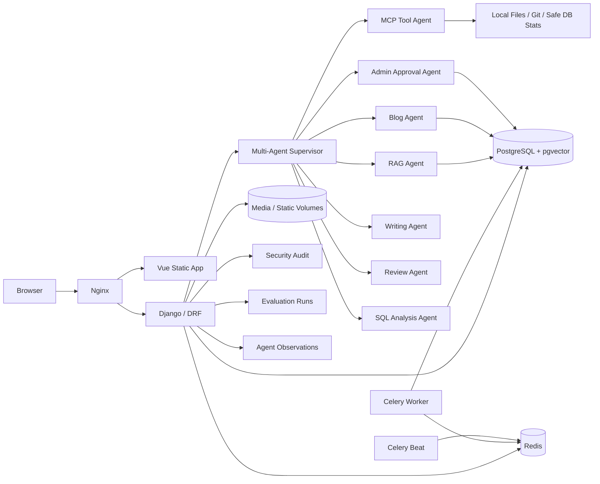
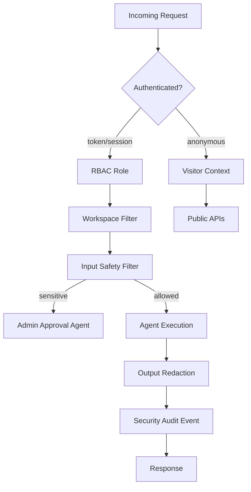

# 系统架构图

```mermaid
flowchart LR
    user[Browser] --> nginx[Nginx]
    nginx --> frontend[Vue Static App]
    nginx --> backend[Django / DRF]

    backend --> supervisor[Multi-Agent Supervisor]
    supervisor --> rag[RAG Agent]
    supervisor --> blog[Blog Agent]
    supervisor --> mcp[MCP Tool Agent]
    supervisor --> approval[Admin Approval Agent]
    supervisor --> writing[Writing Agent]
    supervisor --> review[Review Agent]
    supervisor --> sql[SQL Analysis Agent]

    backend --> postgres[(PostgreSQL + pgvector)]
    backend --> redis[(Redis)]
    backend --> media[(Media / Static Volumes)]
    backend --> audit[Security Audit]
    backend --> eval[Evaluation Runs]
    backend --> obs[Agent Observations]

    celery[Celery Worker] --> postgres
    celery --> redis
    celeryBeat[Celery Beat] --> redis

    rag --> postgres
    blog --> postgres
    mcp --> tools[Local Files / Git / Safe DB Stats]
    approval --> postgres
```

## 安全边界

```mermaid
flowchart TD
    request[Incoming Request] --> auth{Authenticated?}
    auth -->|token/session| role[RBAC Role]
    auth -->|anonymous| visitor[Visitor Context]
    role --> workspace[Workspace Filter]
    visitor --> public[Public APIs]
    workspace --> safety[Input Safety Filter]
    safety -->|sensitive| hitl[Admin Approval Agent]
    safety -->|allowed| agent[Agent Execution]
    agent --> redaction[Output Redaction]
    redaction --> audit[Security Audit Event]
    audit --> response[Response]
```
